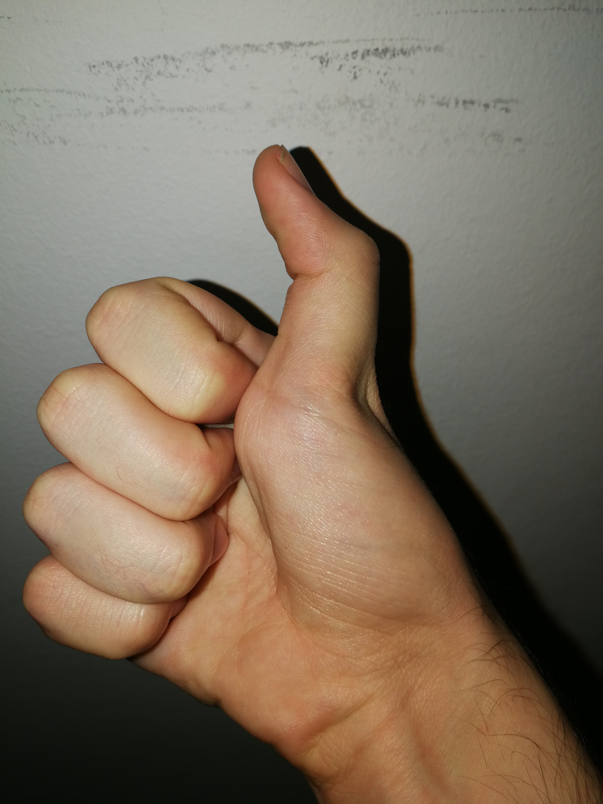

## What is NotThatGameEngine?

NotThatGameEngine is my personal attempt to create a skeletal animation system that is functional is the context of a pseudo-engine. Its reason to be is found in the Enginge subject from CITM's third year of the Videogame Design & Development degree, conducted by our lovely teacher [Marc Garrigó](https://www.linkedin.com/in/mgarrigo/). His engine has been used as reference: [ThorEngine](https://github.com/markitus18/Thor-Engine).

### Team members

Me: I did everything. Well, props to hopes & dreams for being there as well, and Thor Engine, because let's face it, having reference makes things easier. A photo of me:

### Skeletical animation

This is the main (and only) sub-system of the engine. It reads a .fbx or .obj (or .FBX and .OBJ) and, using the ASSIMP library, checks if there's an animation inside. However, due to the limitations of the library, it means we won't always read animations even if the model has them. It will depend if they have been correctly composed into the model. The good part is that once the animation set-up is completed, the animation system works consistently (as far as I'm concerned). Animations play based on the engine's dt, and information about them is displayed. That is both the duration and ticks per second, with an extra value calculated internally: the real duration.

Real duration is simply obtained by doing time / ticks per second, and it's a way to understand how long the animation actually takes independantly of the speed at which animation frames are read. The only "but" to consider is that the time measure that it gives as a result is not in real seconds, but in engine seconds. Thus an animation with realDuration = 50 will last different time depending on the engine's dt.

Bones can be displayed using boxes in their initial positions. Very performance expensive, though. Animations also count with looping options and blending, albeit only with two animations. No matter which of the two finishes first, it won't affect the other's performance. Animations can be added via "Add animation", which adds an animation component to the gameObject. It usually is useless, since bone naming won't correspond between models, but the option exists.

Finally, the system that may be more editor oriented is the "Animation Even Editor". This is a pop-up window tha allows to trigger an event (from the code, using the EVENT_ENUM class enum) in a specific frame, with the capability to choose between doing it once or every time the frame is gone through. The only problem this may pose is the user wants to trigger an event everytime we come from a different state on a looping animation: currently, it works based on a bool. If it repeats, it will throw the event every time. If it does so only once, even if the animation ends, another one plays, and then it plays again, it won't trigger the event (this has easy solution, adding another bool to the mix). As a final note, if the event is -1, it will not throw an event. Those events are saved and loaded correctly, and they can be added infinitly, as well as removed from each animation.

### The editor

If anyone was wondering, the name of the engine comes from ThatGameCompany, which has a philosophy of game design I ressonate a lot with. However, knowing comparing myself (or adopting their name) to them is quite arrogant, I decided to add the "Not" as a way to subvert the reference without having to omit it. This is all to say the Engine is quite trashy. From the beginning it would have been, because we were told to only implement one sub-system, and I did it alone. And I'm a designer. What this comes to say is that it's lacking a lot of life-improvement features, which were moved aside to focus on having a solid animation system (which I ended up having :3).

Nonetheless, a list of useful features of the engine:
- Bounding boxes: self-explanatory
- Normals display: not very useful in my opinion, but it's there
- Child reparenting: I've been told it's a bit shady... And I could have been fixed involuntarely. The only problem is that transforms may be changed, but I've not done too much investigation on this regard. And am not planning to (right now at least) >:v
- Object transforming: user can change an object's position, rotation and scale. Note that pressing 1 or 2 will trigger animations on the robotto model. That's for assignment specific reasons, ignore it
- Component importing: any mesh / material / animation can be added to any other object
- Component / object drop: dropping a mesh / material / texture / model... onto the Engine either adds it to the focused element or adds it to the scene
- Resource management: there is a perfectly (I think) functional resource manager, as long as the Library/ folder's content isn't altered (in any case, you can delete it to "reset" any corrupted material there may be). But it doesn't use traditional resource managing, that is, resource pattern
- Scene serialization: scene can be saved and loaded
- Start / Stop / Tick system: in a very rudimentary way, you can toggle editor mode and game mode. In reality, this only affects animations, but it's there, I guess

### Material

Engine showcase gifs:

Animation usage in the editor:

[Video demonstration](https://youtu.be/F6sp9GHgbM8)

### Links

- [Code repository](https://github.com/ferba93/NotThatGameEngine)
- [Release section](https://github.com/ferba93/NotThatGameEngine/releases)

### License

MIT License

Copyright (c) 2020 Ferran-Roger Basart i Bosch

Permission is hereby granted, free of charge, to any person obtaining a copy
of this software and associated documentation files (the "Software"), to deal
in the Software without restriction, including without limitation the rights
to use, copy, modify, merge, publish, distribute, sublicense, and/or sell
copies of the Software, and to permit persons to whom the Software is
furnished to do so, subject to the following conditions:

The above copyright notice and this permission notice shall be included in all
copies or substantial portions of the Software.

THE SOFTWARE IS PROVIDED "AS IS", WITHOUT WARRANTY OF ANY KIND, EXPRESS OR
IMPLIED, INCLUDING BUT NOT LIMITED TO THE WARRANTIES OF MERCHANTABILITY,
FITNESS FOR A PARTICULAR PURPOSE AND NONINFRINGEMENT. IN NO EVENT SHALL THE
AUTHORS OR COPYRIGHT HOLDERS BE LIABLE FOR ANY CLAIM, DAMAGES OR OTHER
LIABILITY, WHETHER IN AN ACTION OF CONTRACT, TORT OR OTHERWISE, ARISING FROM,
OUT OF OR IN CONNECTION WITH THE SOFTWARE OR THE USE OR OTHER DEALINGS IN THE
SOFTWARE.

